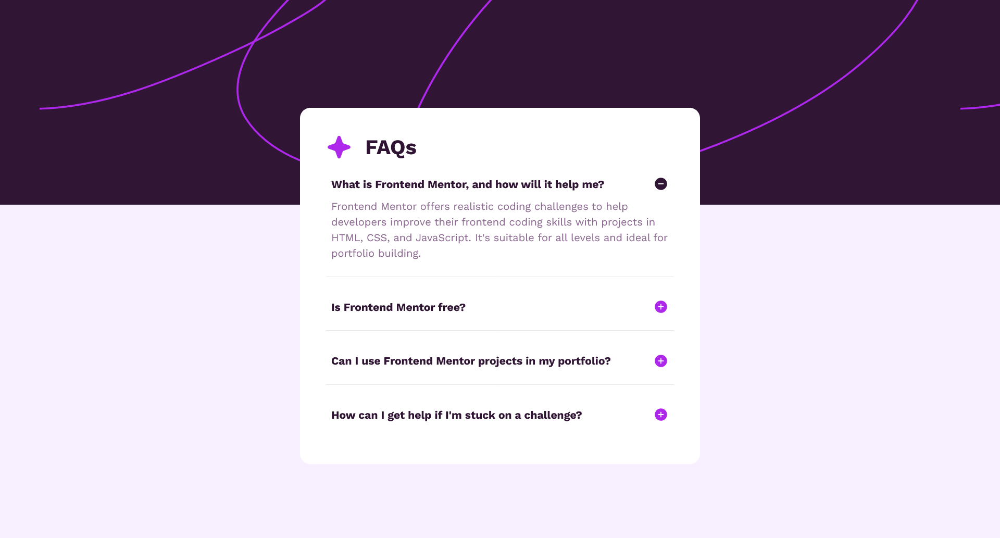

# Frontend Mentor - Solution FAQ accordion

Ceci est ma solution au [défi FAQ accordion de Frontend Mentor](https://www.frontendmentor.io/challenges/faq-accordion-wyfFdeBwBz). Les défis Frontend Mentor permettent de progresser en codant des projets réalistes.

## Table des matières

- [Aperçu](#aperçu)
  - [Le défi](#le-défi)
  - [Capture d'écran](#capture-décran)
  - [Liens](#liens)
- [Mon processus](#mon-processus)
  - [Technologies utilisées](#technologies-utilisées)
  - [Ce que j'ai appris](#ce-que-jai-appris)
  - [Pistes d'amélioration](#pistes-damélioration)
  - [Ressources utiles](#ressources-utiles)
- [Auteur](#auteur)

## Aperçu

### Le défi

Les utilisateurs doivent pouvoir :

- Afficher ou masquer la réponse à une question en cliquant sur la question
- Naviguer entre les questions et afficher ou masquer les réponses uniquement au clavier
- Voir une mise en page adaptée à la taille de l'écran de leur appareil
- Voir les états de survol (hover) et de focus de tous les éléments interactifs de la page

### Capture d'écran



### Liens

- URL de la solution : [À compléter](https://your-solution-url.com)
- URL du site en ligne : [À compléter](https://your-live-site-url.com)

## Mon processus

### Technologies utilisées

- HTML5 sémantique
- CSS3 (Flexbox, media queries)
- JavaScript (vanilla)
- Attributs ARIA (`aria-expanded`, `aria-controls`) pour l'accessibilité
- Police variable [Work Sans](https://fonts.google.com/specimen/Work+Sans) hébergée en local

### Ce que j'ai appris

**1. Une valeur `background-size` invalide est ignorée en entier**

J'avais écrit `background-size: cover 30vh;`. Le mot-clé `cover` s'utilise seul : avec une deuxième valeur, la déclaration est invalide et le navigateur l'ignore complètement. Pour fixer la taille d'une image de fond, on donne deux valeurs (largeur puis hauteur), ou on utilise `cover` seul.

**2. Un SVG garde son ratio dans une zone plus large**

Un SVG est dessiné pour tenir entièrement dans la zone qu'on lui donne, sans être déformé. Dans une zone beaucoup plus large que son ratio, il laisse donc des bandes vides sur les côtés. Les valeurs de la bannière doivent aussi être fixes (`px` ou `rem`) plutôt que dépendre de la hauteur de la fenêtre (`vh`), sinon l'alignement avec la carte change selon l'écran.

**3. Un accordéon accessible repose sur un vrai bouton**

Au départ, mes questions étaient des `<div>` avec un écouteur de clic : impossibles à atteindre au clavier. En mettant un `<button>` à l'intérieur du titre `<h2>`, on garde la structure de titres et on obtient gratuitement Tab, Entrée et Espace, ainsi que le focus :

```html
<h2>
  <button class="question" aria-expanded="false" aria-controls="answer-1">
    <span>Is Frontend Mentor free?</span>
    <span class="icon" aria-hidden="true"></span>
  </button>
</h2>
<p class="response" id="answer-1" hidden>…</p>
```

`aria-expanded` indique si le contenu est affiché (`true`) ou masqué (`false`), et `aria-controls` référence l'`id` de l'élément contrôlé.

**4. Laisser le CSS gérer l'icône selon l'état**

Plutôt que de changer le `src` d'une image en JavaScript, le CSS peut choisir l'icône à partir de l'attribut ARIA. Le JavaScript se limite alors à basculer `aria-expanded` :

```css
.icon {
  background: url(./assets/images/icon-plus.svg) center / contain no-repeat;
}
.question[aria-expanded="true"] .icon {
  background-image: url(./assets/images/icon-minus.svg);
}
```

**5. Détails qui font la différence avec la maquette**

- Mettre `box-sizing: border-box` sur `*` pour que le padding ne s'ajoute pas à la largeur
- Déclarer la plage de graisse d'une police variable (`font-weight: 100 900;`) dans la `@font-face`
- Penser à `line-height`, à l'ombre de la carte et au dernier séparateur, qui sont faciles à oublier
- Supprimer les lignes de debug oubliées (un `background: red;` était resté dans mon media query mobile)

### Pistes d'amélioration

- Ajouter une animation douce à l'ouverture et à la fermeture des réponses
- Utiliser des variables CSS pour la palette de couleurs
- Tester avec un lecteur d'écran pour vérifier le comportement réel des attributs ARIA

### Ressources utiles

- [MDN - background-size](https://developer.mozilla.org/fr/docs/Web/CSS/background-size) - m'a aidé à comprendre pourquoi `cover` ne se combine pas avec une autre valeur.
- [WAI-ARIA Authoring Practices - Accordion](https://www.w3.org/WAI/ARIA/apg/patterns/accordion/) - le modèle de référence pour construire un accordéon accessible.

## Auteur

- Frontend Mentor - [@joelavj](https://www.frontendmentor.io/profile/joelavj)
- GitHub - [@joelavj](https://github.com/joelavj)