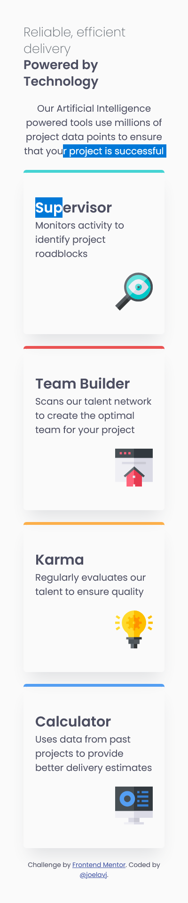
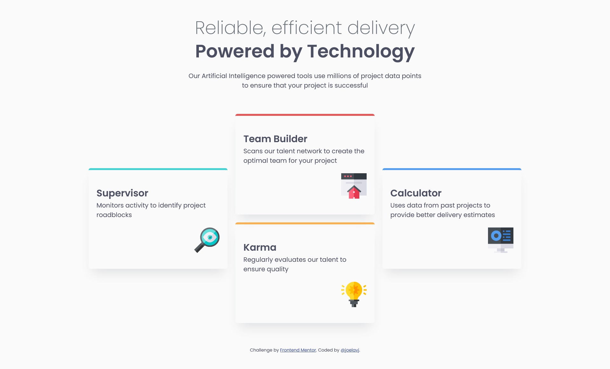

# Frontend Mentor - Solution : Four card feature section

Ma solution au défi [Four card feature section](https://www.frontendmentor.io/challenges/four-card-feature-section-weK1eFYK) de [Frontend Mentor](https://www.frontendmentor.io).

## Table des matières

- [Présentation](#présentation)
  - [Le défi](#le-défi)
  - [Captures d'écran](#captures-décran)
  - [Liens](#liens)
- [Mon parcours](#mon-parcours)
  - [Technologies utilisées](#technologies-utilisées)
  - [Ce que j'ai appris](#ce-que-jai-appris)
  - [Pistes d'amélioration](#pistes-damélioration)
  - [Ressources utiles](#ressources-utiles)
- [Auteur](#auteur)

## Présentation

### Le défi

L'objectif est de reproduire une section présentant quatre fonctionnalités sous forme de cartes, aussi fidèlement que possible aux maquettes fournies.

L'utilisateur doit pouvoir :

- Voir une mise en page adaptée à la taille de son écran (mobile et desktop).

### Captures d'écran

| Mobile (375px) | Desktop (1440px) |
| :---: | :---: |
|  |  |

> Remplace ces images par tes propres captures du rendu final (par exemple dans un dossier `screenshots/`).

### Liens

- Solution (dépôt GitHub) : [https://github.com/joelavj/Frontend-Mentor/tree/main/four-card-feature-section-master](https://github.com/joelavj/Frontend-Mentor/tree/main/four-card-feature-section-master)
- Site en ligne : [https://joelavj.github.io/Frontend-Mentor/four-card-feature-section-master/index.html](https://joelavj.github.io/Frontend-Mentor/four-card-feature-section-master/index.html)

> Vérifie et adapte ces deux liens à ton dépôt réel.

## Mon parcours

### Technologies utilisées

- HTML5 sémantique (`header`, `main`, `section`, `footer`)
- CSS3 avec propriétés personnalisées
- Flexbox
- CSS Grid (`grid-template-areas`)
- Approche mobile-first avec media queries
- Police [Poppins](https://fonts.google.com/specimen/Poppins) (poids 200, 400 et 600) chargée en local

### Ce que j'ai appris

- **Placer des éléments avec `grid-template-areas`** : nommer les zones de la grille rend le décalage des cartes de la version desktop lisible et facile à modifier.
- **Charger plusieurs poids d'une police** : il faut un bloc `@font-face` par poids (`font-weight: 200`, `400`, `600`). Mettre plusieurs fichiers dans un seul `src` ne fait que définir des fichiers de secours, et ne donne pas accès à plusieurs graisses.
- **Soigner les détails visuels** : couleurs de texte et de fond issues du guide de style, ombres douces plutôt qu'un trait appuyé, bordures colorées par carte.
- **Penser accessibilité dès le départ** : `alt=""` sur les icônes décoratives, hiérarchie de titres cohérente (`h1` puis `h2`).
- **Tester à plusieurs largeurs** (de 320px aux grands écrans), et pas seulement aux deux tailles des maquettes.

```css
@font-face {
  font-family: 'Poppins';
  src: url('./assets/fonts/Poppins-SemiBold.ttf') format('truetype');
  font-weight: 600;
  font-display: swap;
}
```

### Pistes d'amélioration

- Ajuster finement les tailles de texte et les espacements pour coller davantage aux maquettes.
- Nettoyer le CSS : retirer les commentaires et propriétés inutiles, et simplifier la grille.
- Affiner la mise en page tablette (par exemple une grille à 2 colonnes entre 600px et 1000px).
- Déplacer les styles d'attribution du HTML vers la feuille de style.

### Ressources utiles

- [MDN - CSS Grid Layout](https://developer.mozilla.org/fr/docs/Web/CSS/CSS_grid_layout) : référence pour `grid-template-areas`.
- [MDN - @font-face](https://developer.mozilla.org/fr/docs/Web/CSS/@font-face) : fonctionnement des polices personnalisées et des poids.
- [Google Fonts - Poppins](https://fonts.google.com/specimen/Poppins) : la police du projet.

## Auteur

- GitHub : [@joelavj](https://github.com/joelavj)
- Frontend Mentor : [@joelavj](https://www.frontendmentor.io/profile/joelavj)