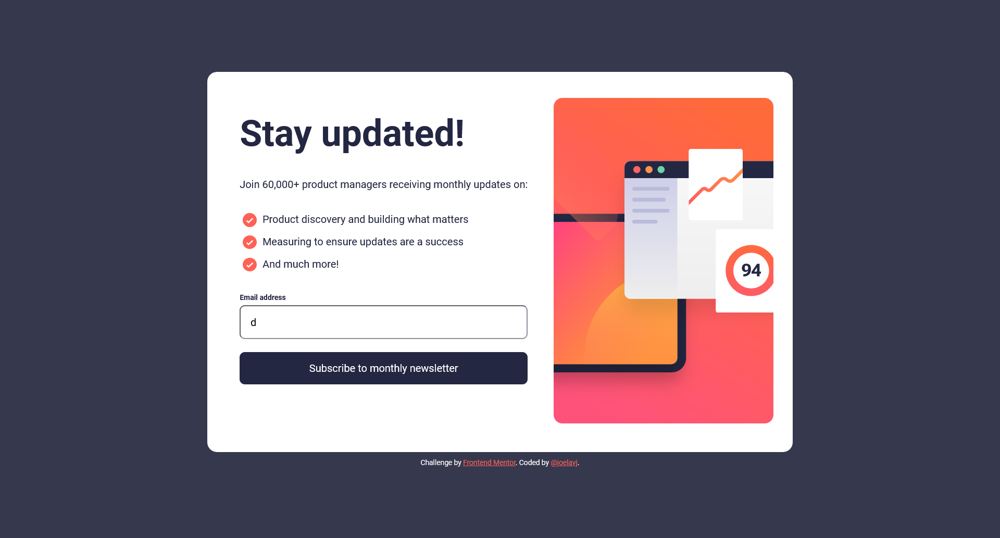

# Frontend Mentor - Solution : Newsletter sign-up form with success message

Voici ma solution au [défi Newsletter sign-up form with success message de Frontend Mentor](https://www.frontendmentor.io/challenges/newsletter-signup-form-with-success-message-3FC1AZbNrv). Les défis Frontend Mentor aident à progresser en codant des projets réalistes.

## Table des matières

- [Aperçu](#aperçu)
  - [Le défi](#le-défi)
  - [Capture d'écran](#capture-décran)
  - [Liens](#liens)
- [Mon processus](#mon-processus)
  - [Technologies utilisées](#technologies-utilisées)
  - [Ce que j'ai appris](#ce-que-jai-appris)
  - [Pistes d'amélioration](#pistes-damélioration)
  - [Ressources utiles](#ressources-utiles)
  - [Collaboration avec l'IA](#collaboration-avec-lia)
- [Auteur](#auteur)

## Aperçu

### Le défi

L'utilisateur doit pouvoir :

- Saisir son email et envoyer le formulaire
- Voir un message de succès contenant son email après un envoi réussi
- Voir des messages de validation si :
  - le champ est vide
  - l'adresse email est mal formatée
- Profiter d'une mise en page adaptée à la taille de son écran
- Voir les états hover et focus de tous les éléments interactifs

### Capture d'écran



### Liens

- URL de la solution : [newsletter-sign-up-with-success-message-main](https://github.com/joelavj/Frontend-Mentor/tree/main/newsletter-sign-up-with-success-message-main)
- URL du site en ligne : [https://joelavj.github.io/newsletter-sign-up-with-success-message-main/index.html](https://joelavj.github.io/Frontend-Mentor/newsletter-sign-up-with-success-message-main/index.html)

## Mon processus

### Technologies utilisées

- HTML5 sémantique
- CSS3 : Flexbox, media queries, approche mobile-first, polices Roboto hébergées en local (`@font-face`)
- Images responsives avec l'élément `<picture>` (trois illustrations : mobile, tablette, desktop)
- JavaScript natif (manipulation du DOM, événements, expression régulière)

### Ce que j'ai appris

**Afficher des données saisies : `textContent` plutôt que `innerHTML`.**
Insérer l'email de l'utilisateur avec `innerHTML` permet d'injecter du HTML (donc du code) dans la page. `textContent` traite la saisie comme du simple texte, ce qui supprime le risque.

```js
strong.textContent = email;
```

**Les champs de formulaire n'héritent pas de la police.**
`input` et `button` utilisent par défaut la police du navigateur. Il faut leur demander d'hériter explicitement pour garder la même typographie que le reste de la page.

```css
input,
button {
  font: inherit;
}
```

**Des images différentes selon l'écran avec `<picture>`.**
L'élément `<picture>` permet de charger l'illustration adaptée à la largeur de l'écran au lieu de redimensionner une seule image.

```html
<picture>
  <source srcset="./assets/images/illustration-sign-up-desktop.svg" media="(min-width: 1000px)" />
  <source srcset="./assets/images/illustration-sign-up-tablet.svg" media="(min-width: 600px)" />
  
</picture>
```

**Validation côté client.**
J'ai désactivé la validation native (`novalidate`) pour afficher mes propres messages, en combinant une vérification du champ vide et une expression régulière pour le format de l'email.

**Contraste des couleurs.**
Un texte lisible sur fond clair peut devenir illisible sur fond sombre : le style du pied de page doit s'adapter à l'arrière-plan de la page.

### Pistes d'amélioration

- **Accessibilité du formulaire** : relier le message d'erreur au champ (`aria-invalid`, `aria-describedby`), l'annoncer aux lecteurs d'écran (`role="alert"` ou `aria-live`), gérer le focus à l'affichage du message de succès, et ajouter des styles `:focus-visible` explicites.
- **Sémantique** : n'avoir qu'un seul `<h1>` par page, renseigner les attributs `alt` des images et ajouter `autocomplete="email"` sur le champ.
- **Unités** : utiliser des unités relatives (`rem`, `100dvh`) plutôt que des valeurs fixes pour mieux respecter les préférences de l'utilisateur.
- **Lisibilité du code** : harmoniser le nommage (une seule langue, camelCase) et les points-virgules.

### Ressources utiles

- [MDN - L'élément `<picture>`](https://developer.mozilla.org/fr/docs/Web/HTML/Element/picture) - pour servir des images adaptées à chaque écran.
- [MDN - `Node.textContent`](https://developer.mozilla.org/fr/docs/Web/API/Node/textContent) - pour comprendre la différence avec `innerHTML`.
- [MDN - Validation des formulaires](https://developer.mozilla.org/fr/docs/Learn_web_development/Extensions/Forms/Form_validation) - pour la validation côté client.

### Collaboration avec l'IA

J'ai utilisé Claude pour une revue de code de mon projet. Il m'a aidé à repérer une faille d'injection HTML (`innerHTML`), un problème de contraste dans le pied de page, la police non héritée par les champs de formulaire et plusieurs points d'accessibilité. J'ai appliqué les corrections de code et de style, et je garde l'accessibilité comme prochaine étape. Ce qui a bien fonctionné : un diagnostic concret, priorisé et testé dans un navigateur. À retenir : toujours vérifier les suggestions moi-même avant de les appliquer.

## Auteur

- GitHub - [@joelavj](https://github.com/joelavj)
- Frontend Mentor - [@joelavj](https://www.frontendmentor.io/profile/joelavj)