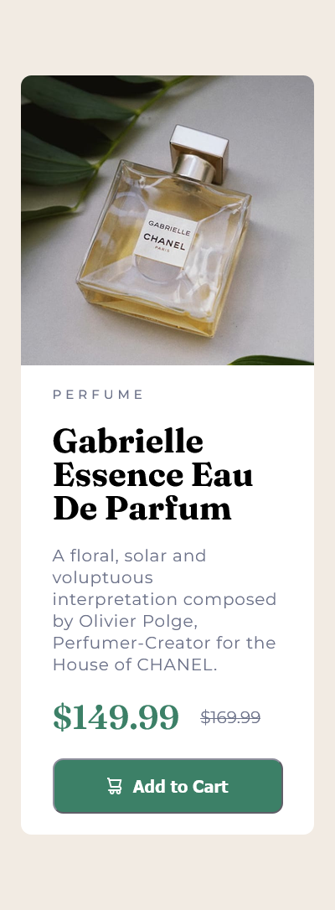
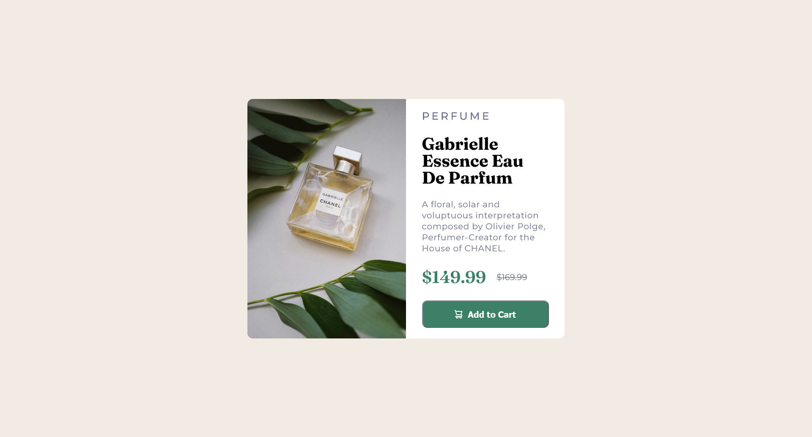

# Frontend Mentor - Solution : Product preview card component

Ceci est ma solution au défi [Product preview card component](https://www.frontendmentor.io/challenges/product-preview-card-component-GO7UmttRfa) de Frontend Mentor. Ces défis permettent de progresser en codant des projets réalistes à partir de maquettes.

## Sommaire

- [Aperçu](#aperçu)
  - [Le défi](#le-défi)
  - [Capture d'écran](#capture-décran)
  - [Liens](#liens)
- [Mon processus](#mon-processus)
  - [Technologies utilisées](#technologies-utilisées)
  - [Ce que j'ai appris](#ce-que-jai-appris)
  - [Pistes d'amélioration](#pistes-damélioration)
  - [Ressources utiles](#ressources-utiles)
  - [Collaboration avec l'IA](#collaboration-avec-lia)
- [Auteur](#auteur)

## Aperçu

### Le défi

L'objectif est de reproduire au plus près de la maquette une carte de présentation de produit (un parfum). L'utilisateur doit pouvoir :

- Voir la mise en page optimale selon la taille de son écran
- Voir les états `hover` et `focus` des éléments interactifs

### Capture d'écran

| Mobile | Desktop |
| :----: | :-----: |
|  |  |

### Liens

- Code source : [product-preview-card-component-main](https://github.com/joelavj/Frontend-Mentor/tree/main/product-preview-card-component-main)
- Site en ligne : [https://joelavj.github.io/product-preview-card-component-main/index.html](https://joelavj.github.io/Frontend-Mentor/product-preview-card-component-main/index.html)

## Mon processus

### Technologies utilisées

- HTML5 sémantique (`article`, `picture`, `del`)
- CSS3 (Flexbox, `clamp()`, media queries)
- `@font-face` avec les polices Montserrat et Fraunces hébergées en local
- Approche mobile-first

### Ce que j'ai appris

**1. Servir deux images selon l'écran avec `<picture>`.**
Au lieu de forcer une seule image à s'adapter avec des astuces CSS, `<picture>` laisse le navigateur choisir la bonne image (verticale en desktop, horizontale en mobile) :

```html
<picture>
  <source media="(min-width: 600px)" srcset="./assets/images/image-product-desktop.jpg">
  
</picture>
```

**2. Charger ses polices correctement.**
Une URL `fonts.google.com/specimen/...` est une page web, pas un fichier de police. Il faut pointer vers le fichier `.ttf` (ou `.woff2`) et prévoir une police de secours :

```css
@font-face {
  font-family: 'Montserrat';
  src: url('./assets/fonts/Montserrat/Montserrat-VariableFont_wght.ttf') format('truetype');
  font-weight: 100 900;
  font-display: swap;
}

.name-product {
  font-family: 'Fraunces', Georgia, serif;
}
```

**3. Choisir un breakpoint selon le contenu, pas selon l'appareil.**
Un seuil à 375 px (la largeur de la maquette mobile) faisait passer la carte en disposition horizontale sur les téléphones. Le seuil doit se situer là où la disposition en colonne cesse d'être confortable.

**4. Accessibilité des détails.**
- L'icône du panier est décorative (`alt=""`) puisque le bouton contient déjà le texte « Add to Cart ».
- Le prix d'origine est dans une balise `<del>`.
- L'état `:focus-visible` du bouton est stylé en plus du `:hover`, pour la navigation au clavier.

**5. Un HTML valide compte.**
Une balise `</head>` oubliée est corrigée silencieusement par le navigateur, mais cela rend le code invalide et peut causer des bugs difficiles à comprendre.

### Pistes d'amélioration

- Tester la carte sur toute la plage de largeurs, de 320 px aux grands écrans, et pas seulement aux deux tailles de la maquette.
- Convertir les polices en `.woff2` pour réduire le poids de la page.
- Utiliser des variables CSS pour les couleurs du style guide.
- Valider le HTML avec le validateur du W3C avant de soumettre un projet.

### Ressources utiles

- [MDN - L'élément `<picture>`](https://developer.mozilla.org/fr/docs/Web/HTML/Element/picture) - pour comprendre l'art direction avec plusieurs images.
- [MDN - `@font-face`](https://developer.mozilla.org/fr/docs/Web/CSS/@font-face) - pour charger des polices locales avec `font-display`.
- [MDN - `:focus-visible`](https://developer.mozilla.org/fr/docs/Web/CSS/:focus-visible) - pour styler le focus clavier.

### Collaboration avec l'IA

J'ai utilisé Claude comme relecteur de code. Je lui ai soumis mon projet terminé pour obtenir un diagnostic : il a rendu la page à plusieurs largeurs d'écran et m'a signalé les bugs (texte masqué à partir de 375 px, image desktop jamais utilisée, polices qui ne se chargeaient pas). J'ai ensuite corrigé le code moi-même.

Ce qui a bien fonctionné : avoir une liste de problèmes classés par priorité, avec la cause de chacun. Ce qui demande de rester vigilant : vérifier moi-même chaque correction dans le navigateur plutôt que de faire confiance aveuglément.

## Auteur

- GitHub - [@joelavj](https://github.com/joelavj)
- Frontend Mentor - [@joelavj](https://www.frontendmentor.io/profile/joelavj)